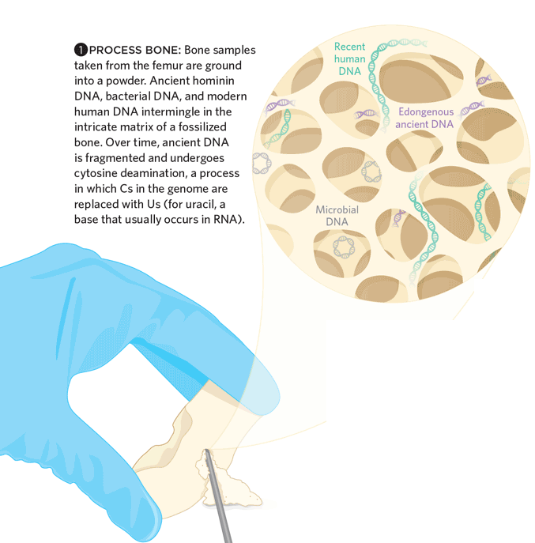
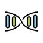
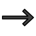

# Who am I?

- Education
  - B.Sc. Bioarchaeology (University of York, UK)
  - M.Sc. Naturwissenschaftliches Archäologie (University of Tübingen, DE)
  - Ph.D. Archaeogenetics (MPI-SHH / MPI-EVA, DE)

- Experience
  - Number of genetics classes taken: 0
  - Number of bioinformatics classes taken: 0

<div>
  
  
  <span style=""> @jfy133</span>
</div>
<a style="font-size:12px" href="openmoji.org">Icons designed by OpenMoji. License: CC BY-SA 4.0</a>

# Today we will 

1. Describe basics of DNA
1. Introduce what DNA sequencing is
2. Explain how Illumina **NGS** sequencing **data** is generated
3. How to evaluating NGS data [Practical]

# Introduction to DNA {data-background="assets/img/IMPRS_SHH_SummerSchool_2021-SectionSlide.jpg" style="color:white;text-align:left" class="center"}

# What is DNA?

> Deoxyribonucleic acid (/diːˈɒksɪˌraɪboʊnjuːˌkliːɪk, -ˌkleɪ-/ (DNA) is a molecule composed of two polynucleotide chains that coil around each other to form a double helix carrying genetic instructions for the development, functioning, growth and reproduction of all known organisms and many viruses. - [Wikipedia](https://en.wikipedia.org/wiki/DNA)

# What is DNA?


<a style="font-size:12px" href="https://en.wikipedia.org/wiki/File:DNA_Structure%2BKey%2BLabelled.pn_NoBB.png">Zephyris, CC BY-SA 3.0 via Wikimedia Commons</a>

# What is DNA?


<a style="font-size:12px" href="https://commons.wikimedia.org/wiki/File:Structure_ADN.png">Pradana Aumars, CC BY-SA 4.0, via Wikimedia Commons</a>

# The rules

- Four nucleotides
  - Pyrimidines: `C`ytosine, `T`hymine
  - Purines: `G`uanine `A`denine & 
- Base pairing: one pyrimidine with one purine
  - `C` with `G` (think: CGI)
  - `A` with `T` (think: AT-AT walker)
- Complementary
  - `C` on one strand, `G` on the other (or _v.v._)
  - `A` on one strand, `T` on the other (or _v.v._)


<a style="font-size:12px" href="https://thenounproject.com/term/at-at-walker/305739/">AT-AT Walker by Nick Bluth from the Noun Project, CC BY 3.0</a>

# The rules

- Make copy of a DNA strand with a _polymerase_
  - Unwind the DNA
  - Separate the strands
  - Make new strand: find a `C`, get new `G` (etc)

  </a>
  <a style="font-size:12px;display:block;margin-left:auto;margin-right:auto" href="https://commons.wikimedia.org/wiki/File:DNA_replication_split.svg">I, Madprime, CC0, via Wikimedia Commons</a>

# How do we get DNA?


<a style="font-size:12px" href="https://commons.wikimedia.org/wiki/File:Figure_17_01_02.jpg">CNX OpenStax, CC BY 4.0, via Wikimedia Commons</a>

# What about ancient DNA?

- Basically the same, except: aDNA molecules are degraded
  - Fragmented (**short** molecules)
  - Damaged (modified nucleotides)
  
<a title="Sequencing ancient DNA © 2015 Lucy Reading / The Scientist. All rights reserved. Used here for training purposes only." href="https://www.lucyreading.co.uk/project/ancient-dna/"></a>

<a style="font-size:12px" href="https://support.illumina.com/bulletins/2016/04/adapter-trimming-why-are-adapter-sequences-trimmed-from-only-the--ends-of-reads.html">© 2015 Lucy Reading / The Scientist. All rights reserved. Modified and used here for training purposes only.</a>

# Introduction to DNA Sequencing {data-background="assets/img/IMPRS_SHH_SummerSchool_2021-SectionSlide.jpg" style="color:white;text-align:left" class="center"}

# What is Sequencing?

Converting the chemical nucleotides of a DNA molecule 

to 

```ACTG``` on your computer screen

<p align="center">



</p>
<a style="font-size:12px" href="openmoji.org">Icons designed by OpenMoji. License: CC BY-SA 4.0</a>

# Historically


<a style="font-size:12px" href="https://commons.wikimedia.org/wiki/File:Sanger-sequencing.svg">Estevezj, CC BY-SA 3.0 via Wikimedia Commons</a>

- Sanger sequencing
  - Separate strands, add primer (starting point)
  - Add mix of nucleotides, some with special 'terminators'
  - Pass through size-filtering, read order of terminators

# Pros and cons of Sanger Sequencing

- Pros
  - Very precise (few errors, still the 'gold standard')
  - Sequence long DNA molecules 
- Cons
  - Resource heavy, requiring lot of input DNA
  - Slow: one. fragment. at. a. time.

# What is NGS?

- "Next Generation Sequencing"
  - Sequence millions and even billions of DNA reads at once!
  - via MASSIVE multiplexing!
  - Sequence lots of samples at once!
  - Fast and cheap!

> Not really 'next' anymore, consider it more 'second' generation (see: Nanopore)

# What is NGS?

<div>
  <span style="">Market leader:</span>
  
</div>


<a style="font-size:12px" href="https://commons.wikimedia.org/wiki/File:Illumina_HiSeq_2500.jpg">Konrad Förstner, CC0, via Wikimedia Commons</a>

(Others: Roche 454, PacBio, IonTorrent etc.)

# How does it work?

- Basically same concept, but:
  - no size separation 
  - with pretty pictures!

i.e. to a strand, attach a complementary fluorophore-modified nucleotide, (normally) one colour per base

<p style="color:red"><b>A</b></p>
<p style="color:blue"><b>G</b></p>
<p style="color:green"><b>T</b></p>
<p style="color:gold"><b>C</b></p>

Fire mah lazer, and take a picture! Rinse and repeat!

# How does it work?

<iframe src='https://gfycat.com/ifr/BlackGreedyAurochs' frameborder='0' scrolling='no' allowfullscreen width='640' height='412'></iframe>
<a style="font-size:12px" href="https://gfycat.com/blackgreedyaurochs">via Gfycat</a>

# Where does this happen?

On a 'flow cell'

</a>
<a style="font-size:12px" href="https://currentprotocols.onlinelibrary.wiley.com/doi/full/10.1002/0471142905.hg1802s79#">Bronner et al. (2013) Current Protocols in Human Genetics, DOI: (10.1002/0471142905.hg1802s79)</a>

# Where does this happen?

**But how do you get your DNA to attach to the lawn**

**(and not get lost)?**

- Convert it to _library_:
  - Add adapters: bind to the 'lawn' of the flow cell
  - Add indexes: sample-specific barcode
  - Add priming sites: where enzymes start copying DNA

<style>
 span.minicode {font-family: monospace;font-size: 14px}
</style>

<span class="minicode" style="color:green">AATGATACGGCGACCACCAC</span><span class="minicode" style="color:purple">accgacaa</span><span class="minicode" style="color:green">CCCTACACGACGCTCTTCCGATCT</span><span class="minicode" style="color:black">XXXXXX</span><span class="minicode" style="color:blue">AGCACACGTCTGAACTCCAGTCAC</span><span class="minicode" style="color:red">gacacta</span><span class="minicode" style="color:blue">CCGTCTTCTGCTTG</span>
<span class="minicode" style="color:green">||||||||||||||||||||</span><span class="minicode" style="color:purple">||||||||</span><span class="minicode" style="color:green">||||||||||||||||||||||||</span><span class="minicode" style="color:black">||||||</span><span class="minicode" style="color:blue">||||||||||||||||||||||||</span><span class="minicode" style="color:red">|||||||</span><span class="minicode" style="color:blue">||||||||||||||</span>
<span class="minicode" style="color:green">TTACTATGCCGCTGGTGGTG</span><span class="minicode" style="color:purple">tggctgtt</span><span class="minicode" style="color:green"></span><span class="minicode" style="color:green">GGGATGTGCTGCGAGAAGGCTAGA</span><span class="minicode" style="color:black">XXXXXX</span><span class="minicode" style="color:blue">TCGTGTGCAGACTTGAGGTCAGTG</span><span class="minicode" style="color:red">ctgtgat</span><span class="minicode" style="color:blue">GGCAGAAGACGAAC</span>

<span class="minicode" style="color:green">[Adapter & Index Primer] </span><span class="minicode" style="color:purple">[Index] </span><span class="minicode" style="color:green">[Target primer] </span><span class="minicode" style="color:black">[Target] </span><span class="minicode" style="color:blue">[Target primer] </span><span class="minicode" style="color:red">[Index] </span><span class="minicode" style="color:blue">[Adapter & Index Primer]</span>

# Sequencing-by-synthesis

Once bound, florescence of one molecule not enough...


<a style="font-size:12px">DMLapato, CC BY-SA 4.0, via Wikimedia Commons</a>

- Make lots of copies, a.k.a. clustering!
- One cluster == many copies of one DNA molecule

# Sequencing-by-synthesis


<a style="font-size:12px">Abizar Lakdawalla , CC BY 3.0, via https://openlab.citytech.cuny.edu/</a>

1. Add florescent nucleotides (complementary will bind)
2. Wash away unbound nucleotides
3. Fire laser & take photo
4. Remove fluorophore
5. Back to **1** ⤴️

# What does this look like?


<a style="font-size:12px" href="https://www.ebi.ac.uk/training/online/courses/functional-genomics-ii-common-technologies-and-data-analysis-methods/next-generation-sequencing/illumina-sequencing/">EMBL-EBI Training, CC BY-SA 4.0, via https://www.ebi.ac.uk/training/</a>

# Improving quality

- Over time, imaging reagents get 'tired' and more errors occur
  - Bases sometimes don't bind, or multiple == clusters 'desynced'
  - **Base-quality**: machine calculates probability it got the 'right' nucleotide for each photo
  - 'Dead' base call: typically reported as `N`

- How to improve or correct?

# Improving quality

- Improvement: **paired-end sequencing**
  - Get order of nucleotides by sequencing from one end
  - Get reverse order of nucleotides - sequence other end!
  - Bonus: sequence more of read longer than cycles
  


<a style="font-size:12px;display:block;margin-left:auto;margin-right:auto" href="https://support.illumina.com/bulletins/2016/04/adapter-trimming-why-are-adapter-sequences-trimmed-from-only-the--ends-of-reads.html">© 2021 Illumina, Inc. All rights reserved. Used here for training purposes only.</a>

# Photos to DNA string

- Special software (e.g. `bcl2fastq`):
 
- For each location on the flow cell (cluster):
  - Record the sequence of bases (from colours)
  - Calculates a probability the 'base call' is correct 
    i.e. blurry or weak image?
  - Note the index in the sequence (sample-specific barcode)
- Group each recorded sequence or 'reads' with those with the same index 
  - a.k.a. demultiplexing
  
# FASTQ File

> FASTQ format is a text-based format for storing both a biological sequence (usually nucleotide sequence) and its corresponding quality scores. Both the sequence letter and quality score are each encoded with a single ASCII character for brevity. - [Wikipedia](https://en.wikipedia.org/wiki/FASTQ_format)

# FASTQ File

Example

```
@K00233:37:HGHLYBBXX:3:1101:2646:1121 1:N:0:NACGCATC+NGCTAATG
NCGCATGAGCCGCCTGTATCAGGCGCTGATCGAACCGGGCATTGCAGTTGGGATAGATCGGAAGAGCACACGTCTG
+
#A7F<<AA<JFJFJJJJJJFFJJJJJJJAFFJFJJJJJJJFJAFFFJAJFJJ<FJJJJJFFF<FFA--FFFJJJJJ
@K00233:37:HGHLYBBXX:3:1101:4655:1121 1:N:0:NACGCATC+NGCTAATG
NATGCATGACAGGAGGTGAGGGCATTTTCCAGATTTTCAGGCTGCGACCTTGAGCATCTTTCGCCGCTTCCAGCAC
+
#AA-<FFFF7JFF7JJJJJFJJ<JJJJJA7FJJJJJJJFF<JFF<J7-<FJJJJFJFFJJJAAAAFFJJ--AJAJJ
```

```
@ <read id, e.g. machine ID, location on flowcell> <extra metadata>
  <DNA sequence; Note: N = base couldn't be called!>
+ <a separator>
  <base quality scores for each nucleotide in sequence>
```

Quality score

```
!"#$%&'()*+,-./0123456789:;<=>?@ABCDEFGHIJ
0.2......................26...31........41          
```


# Things to remember

- Adapters and indices
  - a.k.a. sequencing 'artefacts' not the real DNA molecule!
- Base qualities
  - Cycle-quality decay
- Paired-end sequencing!
  - Merge together: better confidence in base call
  
# Recap

- DNA molecules essentially: 
  - Made up of nucleotides (`ACTG`)
  - Two strands: complementary base pairs (`C-G`, `A-T`)
  - aDNA are fragmented molecules: **short**
- NGS Sequencing: 
  - Massively multiplexed: millions DNA molecules at once
  - Add **adapters** to bind to a glass slide
  - Make new strand, adding **florescent nucleotides**
  - Fire laser at each nucleotide and take photo
- Results in **FASTQ* file
  - Has base quality scores

<!-- TODO ADD ALL CREDITS FOR IMAGES UNDER EACH A LA THE ILLUMINA ONE -->

<!-- questions to ask 


1. Why do ends go down?
3. Why are there so many adapter sequences in this ancient DNA library?
2. What is the sequencing cycle limit of this PE run?


-->

# Practical: Introduction to NGS data processing {data-background="assets/img/IMPRS_SHH_SummerSchool_2021-SectionSlide.jpg" style="color:white;text-align:left" class="center"}

# Working on the command-line

What is the command line?

> A command-line interface (CLI) processes commands to a computer program in the form of lines of text. - [Wikipedia](https://en.wikipedia.org/wiki/Command-line_interface)

- i.e. use words, not point and click with mouse
- **Important**: more efficient/scalable & more reproducible
- Most **bioinformatics** work is performed via command line
  - Often as working on remote _servers_ (i.e. very large computers with no screen)
  
# Logging into a server

1. Open browser
2. Go to: <LINK>
3. Log-in with your credentials

# The command line

> A command prompt (or just prompt) is a sequence of (one or more) characters used in a command-line interface to indicate readiness to accept commands. - [Wikipedia](#https://en.wikipedia.org/wiki/Command-line_interface#Command_prompt)

```bash
james_fellows_yates@bionc21:~$ 
```
```console
<username>@<machine_name>:<current_directory>$
```

- Everything _after_ `$` is where you type your _command_ 
- Never copy and paste the prompt!
- ⚠️Prompts look different on different machines!

# Your first command

Type in everything _after_ the prompt, and press enter/return (⏎) on your keyboard with

```bash
$ echo "Hello world!"
```
```console
Hello world!
```

- Command typically consists of:
  1. Program/software/tool name
  2. Arguments (e.g. input files)
  3. Options or flags (e.g. `-h` or `--help`)
  
# Move around

What is in the room (directory)

```bash
$ ls
```

Lets go in the directory, and see what's in there!

```bash
$ cd input/
$ ls -l
```

How to go back?

```bash
$ cd ../
```

  
# Your first bioinformatic job

We will run the [nf-core/eager](https://nf-co.re/eager) pipeline.

> nf-core/eager is a scalable and reproducible bioinformatics best-practise processing pipeline for genomic NGS sequencing data, with a focus on ancient DNA (aDNA) data. It is ideal for the (palaeo)genomic analysis of humans, animals, plants, microbes and even microbiomes.

Pipeline (software): a chain of data-processing processes or other software entities


# Run your first bioinformatic job

```bash
nextflow nf-core/eager -profile singularity,test_tsv --input input/fastqs.tsv
```

# Check the results

What is the output?

```bash
ls
```

```bash
cd results/
```

```bash
multiqc/
```

# Practical: Introduction to NGS data quality control {data-background="assets/img/IMPRS_SHH_SummerSchool_2021-SectionSlide.jpg" style="color:white;text-align:left" class="center"}

# MultiQC Report

