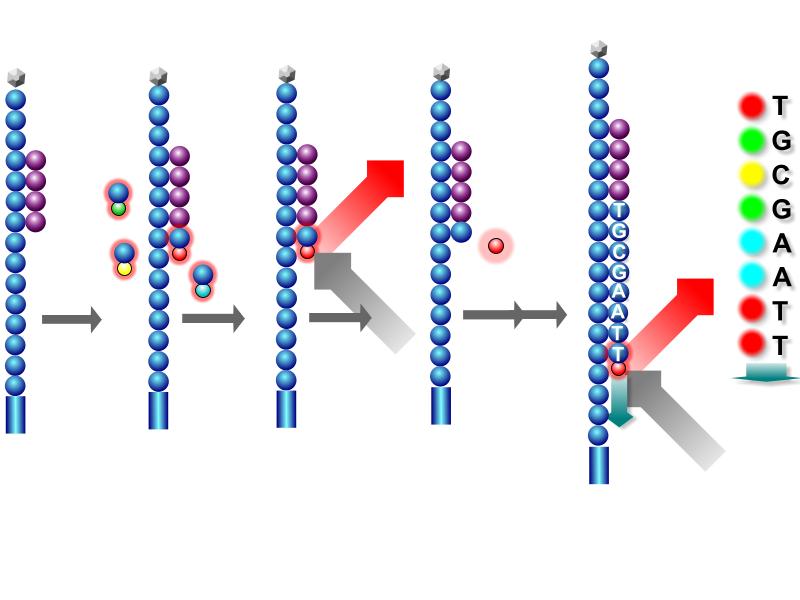

# Who am I?

- Education
  - B.Sc. Bioarchaeology (University of York, UK)
  - M.Sc. Naturwissenschaftliches Archäologie (University of Tübingen, DE)
  - Ph.D. Archaeogenetics (MPI-SHH / MPI-EVA, DE)

- Experience
  - Number of genetics classes taken: 0
  - Number of bioinformatics classes taken: 0

<div>
  
  
  <span style=""> @jfy133</span>
</div>

# Today we will 

1. Describe basics of DNA
1. Introduce what DNA sequencing is
2. Explain how Illumina **NGS** sequencing **data** is generated
3. How to evaluating NGS data [Practical]

# Introduction DNA {data-background="assets/img/IMPRS_SHH_SummerSchool_2021-SectionSlide.jpg" style="color:white;text-align:left" class="center"}

# What is DNA?

> Deoxyribonucleic acid (/diːˈɒksɪˌraɪboʊnjuːˌkliːɪk, -ˌkleɪ-/ (DNA) is a molecule composed of two polynucleotide chains that coil around each other to form a double helix carrying genetic instructions for the development, functioning, growth and reproduction of all known organisms and many viruses. - [Wikipedia](https://en.wikipedia.org/wiki/DNA)

# What is DNA?


<a title="Zephyris, CC BY-SA 3.0 &lt;https://creativecommons.org/licenses/by-sa/4.0&gt;, via Wikimedia Commons" href="https://en.wikipedia.org/wiki/File:DNA_Structure%2BKey%2BLabelled.pn_NoBB.png"></a>

# What is DNA?

<a title="Pradana Aumars, CC BY-SA 4.0 &lt;https://creativecommons.org/licenses/by-sa/4.0&gt;, via Wikimedia Commons" href="https://commons.wikimedia.org/wiki/File:Structure_ADN.png"></a>

# The rules

- Four nucleotides
  - Pyrimidines: `C`ytosine, `T`hymine
  - Purines: `G`uanine `A`denine & 
- Base pairing: one pyrimidine with one purine
  - `C` with `G` (think: CGI)
  - `A` with `T` (think: AT-AT walker)
- Complementary
  - `C` on one strand, `G` on the other (or _v.v._)
  - `A` on one strand, `T` on the other (or _v.v._)

<a title="AT-AT Walker by Nick Bluth from the Noun Project, CC BY 3.0" href="https://commons.wikimedia.org/wiki/File:Structure_ADN.png"></a>

# The rules

- Make copy of a DNA strand with a _polymerase_
  - Unwind the DNA
  - Separate the strands
  - Make new strand: find a `C`, get new `G` (etc)

<p style="align:center">
  <a title="I, Madprime, CC0, via Wikimedia Commons" href="https://commons.wikimedia.org/wiki/File:DNA_replication_split.svg"></a>
</p>
  
# How do we get DNA?


<a title="CNX OpenStax, CC BY 4.0 &lt;https://creativecommons.org/licenses/by/4.0&gt;, via Wikimedia Commons" href="https://commons.wikimedia.org/wiki/File:Figure_17_01_02.jpg"></a>

# Introduction to DNA Sequencing {data-background="assets/img/IMPRS_SHH_SummerSchool_2021-SectionSlide.jpg" style="color:white;text-align:left" class="center"}

# What is Sequencing?

Converting the chemical nucleotides of a DNA molecule 

to 

```ACTG``` on your computer screen

<p align="center">


</p>

# Historically

- Sanger sequencing

<a title="Estevezj, CC BY-SA 3.0 &lt;https://creativecommons.org/licenses/by-sa/3.0&gt;, via Wikimedia Commons" href="https://commons.wikimedia.org/wiki/File:Sanger-sequencing.svg"></a>

- Separate strands, add primer (starting point)
- Add mix of nucleotides, some with special 'terminators'
- Pass through size-filtering, read order of terminators

# Pros and cons of Sanger Sequencing

- Pros
  - Very precise (few errors, still the 'gold standard')
  - Sequence long DNA molecules 
- Cons
  - Resource heavy, requiring lot of input DNA
  - Slow: one. fragment. at. a. time.

# What is NGS?

- "Next Generation Sequencing"
  - Sequence millions and even billions of DNA reads at once!
  - via MASSIVE multiplexing!
  - Sequence lots of samples at once!
  - Fast and cheap!

> Not really 'next' anymore, consider it more 'second' generation (see: Nanopore)

# What is NGS?

<div>
  <span style="">Market leader:</span>
  
</div>

<a title="Konrad Förstner, CC0, via Wikimedia Commons" href="https://commons.wikimedia.org/wiki/File:Illumina_HiSeq_2500.jpg"></a>

(Others: Roche 454, PacBio, IonTorrent etc.)

# How does it work?

- Basically same concept, but:
  - no size separation 
  - with pretty pictures!

i.e. to a strand, attach a complementary fluorophore-modified nucleotide, (normally) one colour per base

<p style="color:red"><b>A</b></p>
<p style="color:blue"><b>G</b></p>
<p style="color:green"><b>T</b></p>
<p style="color:gold"><b>C</b></p>

Fire mah lazer, and take a picture! Rinse and repeat!

# How does it work?

<iframe src='https://gfycat.com/ifr/BlackGreedyAurochs' frameborder='0' scrolling='no' allowfullscreen width='640' height='412'></iframe><p> <a style="font-size:12px" href="https://gfycat.com/blackgreedyaurochs">via Gfycat</a></p>

# Where does this happen?

On a 'flow cell'

<a title="Bronner et al. (2013) Current Protocols in Human Genetics, Volume: 79, Issue: 1, Pages: 18.2.1-18.2.42, First published: 02 January 2014, DOI: (10.1002/0471142905.hg1802s79) " href="https://currentprotocols.onlinelibrary.wiley.com/doi/full/10.1002/0471142905.hg1802s79#"></a>

# Where does this happen?

**But how do you get your DNA to attach to the lawn**

**(and not get lost)?**

- Convert it to _library_:
  - Add adapters: bind to the 'lawn' of the flow cell
  - Add indexes: sample-specific barcode
  - Add priming sites: where enzymes start copying DNA

<style>
 span.minicode {font-family: monospace;font-size: 14px}
</style>

<span class="minicode" style="color:green">AATGATACGGCGACCACCAC</span><span class="minicode" style="color:purple">accgacaa</span><span class="minicode" style="color:green">CCCTACACGACGCTCTTCCGATCT</span><span class="minicode" style="color:black">XXXXXX</span><span class="minicode" style="color:blue">AGCACACGTCTGAACTCCAGTCAC</span><span class="minicode" style="color:red">gacacta</span><span class="minicode" style="color:blue">CCGTCTTCTGCTTG</span>
<span class="minicode" style="color:green">||||||||||||||||||||</span><span class="minicode" style="color:purple">||||||||</span><span class="minicode" style="color:green">||||||||||||||||||||||||</span><span class="minicode" style="color:black">||||||</span><span class="minicode" style="color:blue">||||||||||||||||||||||||</span><span class="minicode" style="color:red">|||||||</span><span class="minicode" style="color:blue">||||||||||||||</span>
<span class="minicode" style="color:green">TTACTATGCCGCTGGTGGTG</span><span class="minicode" style="color:purple">tggctgtt</span><span class="minicode" style="color:green"></span><span class="minicode" style="color:green">GGGATGTGCTGCGAGAAGGCTAGA</span><span class="minicode" style="color:black">XXXXXX</span><span class="minicode" style="color:blue">TCGTGTGCAGACTTGAGGTCAGTG</span><span class="minicode" style="color:red">ctgtgat</span><span class="minicode" style="color:blue">GGCAGAAGACGAAC</span>

<span class="minicode" style="color:green">[Adapter & Index Primer] </span><span class="minicode" style="color:purple">[Index] </span><span class="minicode" style="color:green">[Target primer] </span><span class="minicode" style="color:black">[Target] </span><span class="minicode" style="color:blue">[Target primer] </span><span class="minicode" style="color:red">[Index] </span><span class="minicode" style="color:blue">[Adapter & Index Primer]</span>

# Sequencing-by-synthesis

Once bound, florescence of one molecule not enough...

<a title="DMLapato, CC BY-SA 4.0 &lt;https://creativecommons.org/licenses/by-sa/4.0&gt;, via Wikimedia Commons" href="https://commons.wikimedia.org/wiki/File:Cluster_Generation.png"></a>

Make lots of copies, a.k.a. clustering!
One cluster == many copies of one DNA molecule

# Sequencing-by-synthesis

<a title="Abizar Lakdawalla , CC BY 3.0 &lt;https://creativecommons.org/licenses/by/3.0&gt;, via https://openlab.citytech.cuny.edu/" href="https://openlab.citytech.cuny.edu/bio-oer/analyzing-dna/next-gen-sequencing/"></a>

1. Add florescent nucleotides (complementary will bind)
2. Fire laser & take photo
3. Wash away unbound nucleotides
4. Remove fluorophore
5. Back to **1** ⤴️

# What does this look like?

<a title="EMBL-EBI Training, CC BY-SA 4.0 &lt;https://creativecommons.org/licenses/by-sa/4.0&gt;, via https://www.ebi.ac.uk/training/" href="https://www.ebi.ac.uk/training/online/courses/functional-genomics-ii-common-technologies-and-data-analysis-methods/next-generation-sequencing/illumina-sequencing/"></a>

# Improving quality

- Over time, imaging reagents get 'tired' and more errors occur
  - Polymerases aren't perfect
  - Bases sometimes don't bind, or multiple == clusters 'desynced'
  - With each 'photo', machine calculates probability it got the 'right' nucleotide
  - Each photo of each cluster gets a 'base-quality' score
- What if molecule is longer than cycles of imaging?

- Improvement: **paired-end sequencing**
  - Get order of nucleotides by sequencing from one end
  - Get reverse order of nucleotides, by sequencing from the other end

# Paired end sequencing

<a title="MiSeq™, HiSeq™ 1000/1500/2000/2500 and NovaSeq™ 6000 v1.0 reagents paired-end flow cell, © 2021 Illumina, Inc. All rights reserved. Used here for training purposes only." href="https://support.illumina.com/bulletins/2016/04/adapter-trimming-why-are-adapter-sequences-trimmed-from-only-the--ends-of-reads.html"></a>

<a style="font-size:12px" href="https://support.illumina.com/bulletins/2016/04/adapter-trimming-why-are-adapter-sequences-trimmed-from-only-the--ends-of-reads.html">© 2021 Illumina, Inc. All rights reserved. Used here for training purposes only.</a>

# Photos to DNA string

- Special software (e.g. `bcl2fastq`):
 
- For each location on the flow cell (cluster):
  - Record the sequence of bases (from colours)
  - Calculates a probability the 'base call' is correct 
    i.e. blurry or weak image?
  - Note the index in the sequence (sample-specific barcode)
- Group each recorded sequence or 'reads' with those with the same index 
  - a.k.a. demultiplexing
  
# FASTQ File

> FASTQ format is a text-based format for storing both a biological sequence (usually nucleotide sequence) and its corresponding quality scores. Both the sequence letter and quality score are each encoded with a single ASCII character for brevity. - [Wikipedia](https://en.wikipedia.org/wiki/FASTQ_format)

# FASTQ File

Example

```
@K00233:37:HGHLYBBXX:3:1101:2646:1121 1:N:0:NACGCATC+NGCTAATG
NCGCATGAGCCGCCTGTATCAGGCGCTGATCGAACCGGGCATTGCAGTTGGGATAGATCGGAAGAGCACACGTCTG
+
#A7F<<AA<JFJFJJJJJJFFJJJJJJJAFFJFJJJJJJJFJAFFFJAJFJJ<FJJJJJFFF<FFA--FFFJJJJJ
@K00233:37:HGHLYBBXX:3:1101:4655:1121 1:N:0:NACGCATC+NGCTAATG
NATGCATGACAGGAGGTGAGGGCATTTTCCAGATTTTCAGGCTGCGACCTTGAGCATCTTTCGCCGCTTCCAGCAC
+
#AA-<FFFF7JFF7JJJJJFJJ<JJJJJA7FJJJJJJJFF<JFF<J7-<FJJJJFJFFJJJAAAAFFJJ--AJAJJ
```

```
@ <read id, e.g. machine ID, location on flowcell> <extra metadata>
  <DNA sequence>
+ <a separator>
  <base quality scores for each nucleotide in sequence>
```

Quality score

```
!"#$%&'()*+,-./0123456789:;<=>?@ABCDEFGHI
0.2......................26...31........41          
```

# Cons of NGS sequencing

- less accurate (laser/photo can get wrong)
- chemistry limits (DNA strands gets old through heat cycling for denaturing; dirty environment from suboptiomal wash steps etc.) mean short reads (compensated by volume)

# Things to remember

- Indexs
- Adapters
- Cycle-quality decay
- paired-ends!

<!-- TODO ADD ALL CREDITS FOR IMAGES UNDER EACH A LA THE ILLUMINA ONE -->

