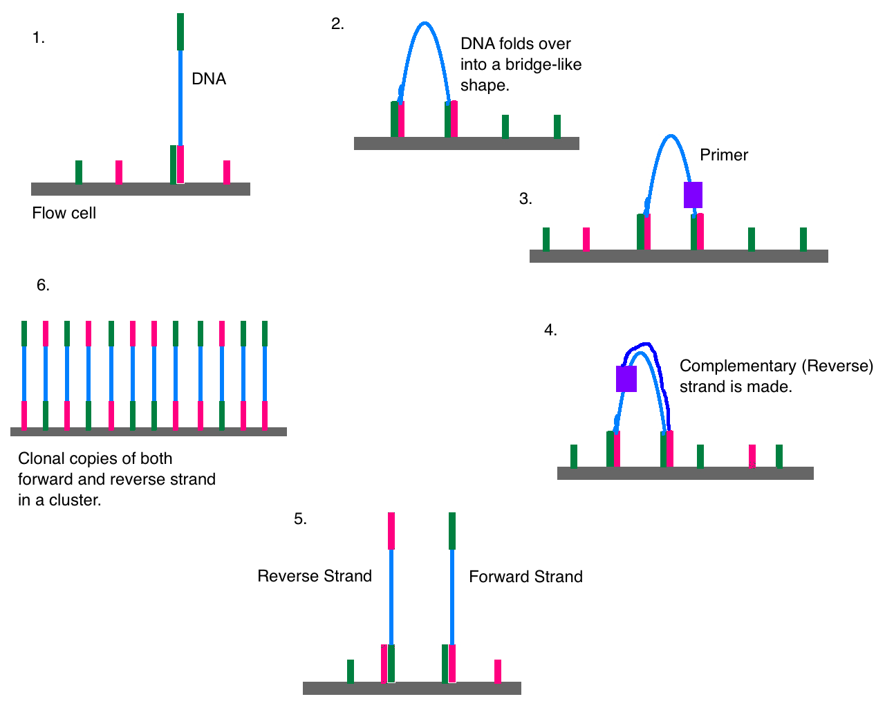

# Why study genetics?

DNA gives instructions for functioning, growth, and reproduction of organisms: living _and_ dead


<a style="font-size:12px" href="https://doi.org/10.1016/j.tree.2015.06.008">Hofman et al. (2015) Trends in Eco. Evo. DOI: 10.1016/j.tree.2015.06.008</a>

Carries much information about the past: ancestry, adaptation to different environments (e.g. diet, disease, etc.)

# Who am I?

- Education
  - B.Sc. Bioarchaeology (University of York, UK)
  - M.Sc. Naturwissenschaftliches Archäologie (University of Tübingen, DE)
  - Ph.D. Archaeogenetics (MPI-SHH / MPI-EVA, DE)

- Experience
  - Number of genetics classes taken: 0
  - Number of bioinformatics classes taken: 0
  
> i.e., YOU CAN LEARN TOO!

<div>
  <span style=""> @jfy133:</span>
  
  
  <span style="">Currently funded by:</span>
  
  

</div>
<a style="font-size:12px" href="openmoji.org">Icons designed by OpenMoji. License: CC BY-SA 4.0</a>

# Today we will 

1. Describe basics of DNA
2. Introduce what DNA sequencing is
3. Explain how Illumina **NGS** sequencing **data** is generated
4. How to preprocess Illumina NGS data [Practical]
5. How to evaluate Illumina NGS data [Practical]

# Introduction to DNA {data-background="assets/img/IMPRS_SHH_SummerSchool_2021-SectionSlide.jpg" style="color:white;text-align:left" class="center"}

# What is DNA?


<a style="font-size:12px" href="https://commons.wikimedia.org/wiki/File:Structure_ADN.png">Pradana Aumars, CC BY-SA 4.0, via Wikimedia Commons</a>

# The rules

- Four nucleotides
  - Pyrimidines: `C`ytosine, `T`hymine
  - Purines: `G`uanine, `A`denine
- **Base** pairing: one pyrimidine with one purine
  - `C` with `G` (think: CGI)
  - `A` with `T` (think: AT-AT walker)
- **Complementary** 
  - `C` on one strand, `G` on the other (or _v.v._)
  - `A` on one strand, `T` on the other (or _v.v._)


<a style="font-size:12px" href="https://thenounproject.com/term/at-at-walker/305739/">AT-AT Walker by Nick Bluth from the Noun Project, CC BY 3.0</a>

# The rules

- Make copy of a DNA strand a.k.a. replication
  - Unwind the DNA
  - Separate the strands
  - Make new strand: find a `C`, get new `G` (etc)
    - via a _polymerase_ (adds from 'free' nucleotides')

  </a>
  <a style="font-size:12px;display:block;margin-left:auto;margin-right:auto" href="https://commons.wikimedia.org/wiki/File:DNA_Polymerase_DNA_Replication.png">Christinelmiller, CC BY-SA 4.0, via Wikimedia Commons</a>

# How do we get DNA?


<a style="font-size:12px" href="https://commons.wikimedia.org/wiki/File:Figure_17_01_02.jpg">CNX OpenStax, CC BY 4.0, via Wikimedia Commons</a>

<aside class="notes">
  Like long squishy spaghetti!
</aside>


# What about ancient DNA?

- Basically the same, except: aDNA molecules are degraded
  - Fragmented (**short** molecules)
  - Damaged (modified nucleotides)
  - Contamination (aDNA in soup of modern DNA)
  
<a title="Sequencing ancient DNA © 2015 Lucy Reading / The Scientist. All rights reserved. Used here for training purposes only." href="https://www.lucyreading.co.uk/project/ancient-dna/"></a>

<a style="font-size:12px" href="https://support.illumina.com/bulletins/2016/04/adapter-trimming-why-are-adapter-sequences-trimmed-from-only-the--ends-of-reads.html">© 2015 Lucy Reading / The Scientist. All rights reserved. Modified and used here for training purposes only.</a>

<aside class="notes">
  aDNA different - like overcooking spaghetti - breaks down into smaller pieces and gets damaged
  Also, _contamination_ from long modern DNA (high quality!)
</aside>

# Introduction to DNA Sequencing {data-background="assets/img/IMPRS_SHH_SummerSchool_2021-SectionSlide.jpg" style="color:white;text-align:left" class="center"}

# What is Sequencing?

Converting the chemical nucleotides of a DNA molecule 

to 

```ACTG``` on your computer screen

<p align="center">


</p>
<a style="font-size:12px" href="openmoji.org">Icons designed by OpenMoji. License: CC BY-SA 4.0</a>

# What is NGS?

- Historically: Sanger sequencing
  - Slow, expensive, resource hungry
- "Next Generation Sequencing"
  - Sequence billions of DNA molecules at once!
  - Fast and cheap!
  - Market leader: Illumina (others: PacBio, IonTorrent)

> More 'second' generation (see: Nanopore)


<a style="font-size:12px" href="https://commons.wikimedia.org/wiki/File:Illumina_HiSeq_2500.jpg">Konrad Förstner, CC0, via Wikimedia Commons</a>

<aside class="notes">
  - Sanger sequencing - one molecule at a time!
</aside>

# How does it work?

Replicate a strand, but add complementary **fluorophore-modified nucleotide**, one colour per base


<a style="font-size:12px" href="http://doi.org/10.1073/pnas.0609513103">Ju et al. (2006) PNAS DOI: 10.1073/pnas.0609513103 </a>

In Illumina: <span style="color:gold"><b>A</b></span>
<span style="color:blue"><b>G</b></span>
<span style="color:green"><b>T</b></span>
<span style="color:red"><b>C</b></span>

Fire mah lazer, and take a picture! Rinse and repeat!

<aside class="notes">
  - When flurophore on cannot continue replication: blocks adding next nucleotide
  - BUT can _clip off_ fluorphore!
</aside>

# How does it work?

<iframe src='https://gfycat.com/ifr/BlackGreedyAurochs' frameborder='0' scrolling='no' allowfullscreen width='640' height='412'></iframe>
<a style="font-size:12px" href="https://gfycat.com/blackgreedyaurochs">via Gfycat</a>

# Where does this happen?

On a 'flow cell': glass slide with synthetic DNA 'lawn' 

</a>
<a style="font-size:12px" href="https://currentprotocols.onlinelibrary.wiley.com/doi/full/10.1002/0471142905.hg1802s79#">Bronner et al. (2013) Current Protocols in Human Genetics, DOI: (10.1002/0471142905.hg1802s79)</a>

<aside class="notes">
  - Lawn has MILLIONS of the synthetici DNA - blades of grass 
</aside>

# Where does this happen?

**But how do you get your DNA to attach to the lawn**

**(and not get lost)?**

- Convert it to _library_:
  - Add adapters: bind to the 'lawn' of the flow cell
  - Add indexes: sample-specific barcode
  - Add priming sites: where enzymes start copying DNA

<style>
 span.minicode {font-family: monospace;font-size: 14px}
</style>

<span class="minicode" style="color:green">AATGATACGGCGACCACCAC</span><span class="minicode" style="color:purple">accgacaa</span><span class="minicode" style="color:green">CCCTACACGACGCTCTTCCGATCT</span><span class="minicode" style="color:black">XXXXXX</span><span class="minicode" style="color:blue">AGCACACGTCTGAACTCCAGTCAC</span><span class="minicode" style="color:red">gacacta</span><span class="minicode" style="color:blue">CCGTCTTCTGCTTG</span>
<span class="minicode" style="color:green">||||||||||||||||||||</span><span class="minicode" style="color:purple">||||||||</span><span class="minicode" style="color:green">||||||||||||||||||||||||</span><span class="minicode" style="color:black">||||||</span><span class="minicode" style="color:blue">||||||||||||||||||||||||</span><span class="minicode" style="color:red">|||||||</span><span class="minicode" style="color:blue">||||||||||||||</span>
<span class="minicode" style="color:green">TTACTATGCCGCTGGTGGTG</span><span class="minicode" style="color:purple">tggctgtt</span><span class="minicode" style="color:green"></span><span class="minicode" style="color:green">GGGATGTGCTGCGAGAAGGCTAGA</span><span class="minicode" style="color:black">XXXXXX</span><span class="minicode" style="color:blue">TCGTGTGCAGACTTGAGGTCAGTG</span><span class="minicode" style="color:red">ctgtgat</span><span class="minicode" style="color:blue">GGCAGAAGACGAAC</span>

<span class="minicode" style="color:green">[Adapter & Index Primer] </span><span class="minicode" style="color:purple">[Index] </span><span class="minicode" style="color:green">[Target primer] </span><span class="minicode" style="color:black">[Target] </span><span class="minicode" style="color:blue">[Target primer] </span><span class="minicode" style="color:red">[Index] </span><span class="minicode" style="color:blue">[Adapter & Index Primer]</span>

<aside class="notes">
  Adapter acts as an ANCHOR against the synthetic DNA on the lawn
  Complementary - binds, and holds DNA on the lawn (everthing unattached gets washed away)
</aside>

# Clustering



<a style="font-size:12px">DMLapato, CC BY-SA 4.0, via Wikimedia Commons</a>


<aside class="notes">

Once bound, florescence of one molecule not enough...
- Make lots of copies via bridge amplification a.k.a. clustering!
- One cluster == many copies of one DNA molecule
- Glass slide is like a lawn with grass
- Lawn oligos have both adapter types (green and purple!)
- A SSed molecule binds to one lawn oligo
- bend molecule over so other end binds to complementary oligo of other end
- Fill in to double strand, denature to separate two strands, and repeated
- Clip off all P5 (other end) adapters to leave only FORWARD read

</aside>

# Sequencing-by-synthesis

1. Add florescent nucleotides (complementary will bind)
2. Wash away unbound nucleotides
3. Fire laser & take photo
4. Remove fluorophore
5. Back to **1** ⤴️ [x50, x75 or x125 times, a.k.a. cycles]


<a style="font-size:12px">Abizar Lakdawalla , CC BY 3.0, via https://openlab.citytech.cuny.edu/</a>

# What does this look like?


<a style="font-size:12px" href="https://www.ebi.ac.uk/training/online/courses/functional-genomics-ii-common-technologies-and-data-analysis-methods/next-generation-sequencing/illumina-sequencing/">EMBL-EBI Training, CC BY-SA 4.0, via https://www.ebi.ac.uk/training/</a>

> Remember: doing this _millions_ of times at once!

# Improving quality

- Over time, imaging reagents get 'tired' and more errors occur
  - Bases sometimes don't bind, or multiple == clusters 'desynced'
  - **Base-quality**: machine calculates probability it got the 'right' nucleotide for each photo
  - 'Dead' base call: typically reported as `N`

- How to improve or correct?

# Improving quality

- Improvement: **paired-end sequencing**
  - Get order of nucleotides by sequencing from one end
  - Get reverse order of nucleotides - sequence other end!
  - Bonus: sequence more of read longer than cycles
  


<a style="font-size:12px;display:block;margin-left:auto;margin-right:auto" href="https://support.illumina.com/bulletins/2016/04/adapter-trimming-why-are-adapter-sequences-trimmed-from-only-the--ends-of-reads.html">© 2021 Illumina, Inc. All rights reserved. Used here for training purposes only.</a>

<aside class="notes">

- Remember on first time around: Clipped off all P5 (other end) adapters to leave only FORWARD read
- Perform bridge amplifcation (bend over), but this time clip off ONLY P7 (orignal end/forward), to leave just reverse

</aside>
  
# FASTQ File

> FASTQ format is a text-based format for storing both a biological sequence (usually nucleotide sequence) and its corresponding quality scores. Both the sequence letter and quality score are each encoded with a single ASCII character for brevity. - [Wikipedia](https://en.wikipedia.org/wiki/FASTQ_format)

# FASTQ File

Example (files can be gigabytes in size!)

```
@K00233:37:HGHLYBBXX:3:1101:2646:1121 1:N:0:NACGCATC+NGCTAATG
NCGCATGAGCCGCCTGTATCAGGCGCTGATCGAACCGGGCATTGCAGTTGGGATAGATCGGAAGAGCACACGTCTG
+
#A7F<<AA<JFJFJJJJJJFFJJJJJJJAFFJFJJJJJJJFJAFFFJAJFJJ<FJJJJJFFF<FFA--FFFJJJJJ
@K00233:37:HGHLYBBXX:3:1101:4655:1121 1:N:0:NACGCATC+NGCTAATG
NATGCATGACAGGAGGTGAGGGCATTTTCCAGATTTTCAGGCTGCGACCTTGAGCATCTTTCGCCGCTTCCAGCAC
+
#AA-<FFFF7JFF7JJJJJFJJ<JJJJJA7FJJJJJJJFF<JFF<J7-<FJJJJFJFFJJJAAAAFFJJ--AJAJJ
```

```
@ <read id, e.g. machine ID, location on flowcell> <extra metadata>
  <DNA sequence; Note: N = base couldn't be called!>
+ <a separator>
  <base quality scores for each nucleotide in sequence>
```

Quality score

```
!"#$%&'()*+,-./0123456789:;<=>?@ABCDEFGHIJ
0.2......................26...31........41          
```


<aside class="notes">
- REMEMBER: MILLIONS OF THESE DNA FRAGMENTS
  - When converting from the photos to FASTQ file
  - Gets read ID (machine, flowcell, coordinate, clusterID)
  - Base quality score
  - REMEMBER 'N'!
</aside>

# Recap

- DNA molecules essentially: 
  - Made up of nucleotides (`ACTG`)
  - Two strands: complementary base pairs (`C-G`, `A-T`)
  - Modern DNA is **long**, aDNA is: **short**
- NGS Sequencing: 
  - Massively multiplexed: millions DNA molecules at once
  - Add **adapters** to bind to a glass slide (lawn)
  - Make new strand, adding florescent nucleotides
  - Fire laser at each nucleotide and take photo
  - Desyncing of clusters result in lower **base-quality** scores over time
  - Improve by **paired-end sequencing**
- Results in *FASTQ* file

# Practical: Introduction to NGS data processing {data-background="assets/img/IMPRS_SHH_SummerSchool_2021-SectionSlide.jpg" style="color:white;text-align:left" class="center"}

# Working on the command-line

What is the command line?

> A command-line interface (CLI) processes commands to a computer program in the form of lines of text. - [Wikipedia](https://en.wikipedia.org/wiki/Command-line_interface)

- i.e. use words, not point and click with mouse
- **Important**: more efficient/scalable & more reproducible
- Most **bioinformatics** work is performed via command line
  - Often as working on remote _servers_ (i.e. very large computers with no screen)
  
# Logging into a server

1. Open browser
2. Go to your assigned IP address
3. Log-in with your assigned **city** username and specify a password

> Remember this password - you won't be asked for confirmation & you will re-use in Microbiome Data Analysis!


<div>
  
  
</div>


# The command line

> A command prompt (or just prompt) is a sequence of (one or more) characters used in a command-line interface to indicate readiness to accept commands. - [Wikipedia](#https://en.wikipedia.org/wiki/Command-line_interface#Command_prompt)

```bash
james_fellows_yates@bionc21:~$ 
```
```console
<username>@<machine_name>:<current_directory>$
```

- Everything _after_ `$` is where you type your _command_ 
- Never copy and paste the prompt!
- ⚠️Prompts look different on different machines!

# Your first command

Type in everything _after_ the prompt, and press enter/return (⏎) on your keyboard with

```bash
$ echo "Hello world!"
```
```console
Hello world!
```

- Command typically consists of:
  1. Program/software/tool name
  2. Arguments (e.g. input files)
  3. Options or flags (e.g. `-h` or `--help`)
  
# Move around

What is in the room (directory)

```bash
$ ls
```

Lets go in the directory, and see what's in there!

```bash
$ cd input/
$ ls -l
```

How to go back?

```bash
$ cd ../
```

# Your first bioinformatic job

1. Check quality of sequencing/reads
2. Remove adapters
3. Merge paired-end reads
4. Check quality of reads again
  
# Your first bioinformatic job

We will run the [nf-core/eager](https://nf-co.re/eager) pipeline.

> nf-core/eager is a scalable and reproducible bioinformatics best-practise processing pipeline for genomic NGS sequencing data, with a focus on ancient DNA (aDNA) data. It is ideal for the (palaeo)genomic analysis of humans, animals, plants, microbes and even microbiomes.

Pipeline (software): a chain of data-processing processes or other software entities

# Your first bioinformatic job


<a style="font-size:12px;display:block;margin-left:auto;margin-right:auto" href="https://doi.org/10.7717/peerj.10947">Fellows Yates et al. (2021) PeerJ. DOI: 10.7717/peerj.10947</a>

# Run your first bioinformatic job

```bash
nextflow run nf-core/eager -profile singularity,test_tsv --input input/fastqs.tsv --fasta input/Mammoth_MT_Krause.fasta
```

# What are we doing? - FastQC


# What are we doing? - AdapterRemoval


<a style="font-size:12px" href="openmoji.org">Icons designed by OpenMoji. License: CC BY-SA 4.0</a>


# Practical: Introduction to NGS data quality control {data-background="assets/img/IMPRS_SHH_SummerSchool_2021-SectionSlide.jpg" style="color:white;text-align:left" class="center"}


# MultiQC Report

<iframe src='assets/img/multiqc_report_testtsv_eager2_2_0.html' frameborder='0' width="100%" height="475px"></iframe>
<a style="font-size:12px;display:block;margin-left:auto;margin-right:auto" href="https://www.jafy.eu/files/multiqc_report_testtsv_eager2_2_0.html">Fellows Yates et al. (2021) PeerJ. DOI: 10.7717/peerj.10947</a>

Github copy: dag-material/\<Intro to NGS\>/assets/files/multiqc_report_testtsv_eager2_2_0.html

<aside class="notes">

1. FQ: Seq Quality Histogram - why going down at end of molecules
2. FQ: Adapter Content - why do we have so many adapter in these **aDNA libraries**
3. AR: Retained Collapsed - why do we expect same number of retained pairs and collapsed pairs?
4. AR: Length distribution - why do we see a peak at 120 for SE reads?
5. PFQ: Seq Quality Histogram - why is everything green now?
6. PFQ: Adapter content - per base content, where has the N gone? 
</aside>
